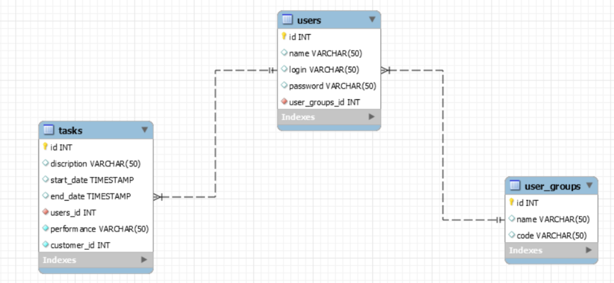
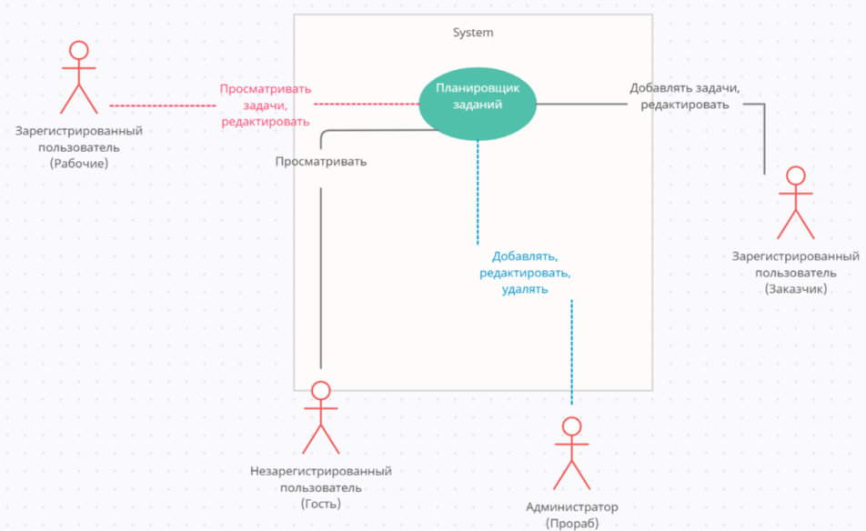

# web - service HCS

## My Project  

1. General information  
2. Information for the user

## General information

Service for servicing the tasks of the housing cooperative.
 

[comment]: <> ( )

## Information for the user

  
First you need to register on the site, indicating your username and password, the password must contain Latin letters, numbers,
must not contain spaces, the password must be at least 8 characters long.   
Admin credentials: admin, lena12345  
Worker credentials: pavel1, pavel12345  
roman1, roman12345   

## ER-diagram  

  

## Use Case diagram  

  

[links to used libraries]  
(https://packagist.org/packages/w1020/html)  
(https://packagist.org/packages/w1020/orm)

[Link to project presentation]  
(https://onedrive.live.com/edit.aspx?action=edit&resid=F48DBD99CE308447!1362&ithint=file%2cpptx)

